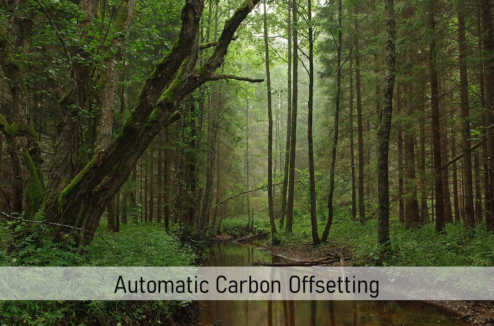

.. Automatic Carbon Offsetting documentation master file, created by
   sphinx-quickstart on Mon Mar 29 09:58:33 2021.
   You can adapt this file completely to your liking, but it should at least
   contain the root `toctree` directive.

Automatic Carbon Offsetting
===================================

About
-------
Researchers in the environmental social sciences, broadly construed, are increasingly studying behavior
in paradigms with actual environmental consequences. While studying people’s willingness to invest in
environmental public goods, many experimentalists rely on emission certificate markets to purchase and
retire certificates to limit the caps in cap-and-trade regulated markets. Thereby, experimental decisions
trigger actual environmental consequences.

Our software-module helps researchers using `oTree <https://otree.readthedocs.io>`_ to automate
the process of purchasing and retiring emission certificates in experiments. When an experiment
is finished, researchers receive an email and are directed to a customized donation form
of `Compensators.org <https://www.compensators.org/>`_, a platform facilitating the purchase and
retirement of certificates. The tool helps researchers to purchase emission certificates with
minimal effort, thereby reducing the entry cost for conducting experiments with environmental
consequences.

This website provides simple step by step instructions that show researchers how to integrate the
software module in their *oTree* projects.

Support
---------
For help, please contact noel.strahm@iop.unibe.ch

Contents:
-----------

.. toctree::
   :maxdepth: 2

   Requirements.rst
   integrate.rst
   Mail.rst
   additional.rst
   calling.rst
   examples.rst
